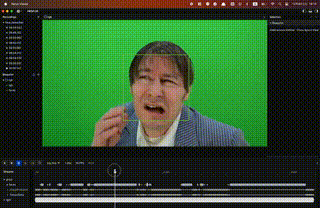

# odi-rerun-visualization



[この記事](https://zenn.dev/articles/52b0080ed72a8d/edit)の中で紹介しているコードのリポジトリになります。

簡単な顔検出を行って、その結果を可視化するコードを

- opencv draw & imshow(ODI)
- rerun

の2つの手法で行っているものです。

# 依存関係のインストール

## 1. パッケージのインストール

```bash
poetry install
```

# 実行

## opencv draw & imshow(ODI)の可視化の実行

```bash
poetry run python src/odi.py
```

## rerunの可視化の実行

```bash
poetry run python src/rerun.py
```
